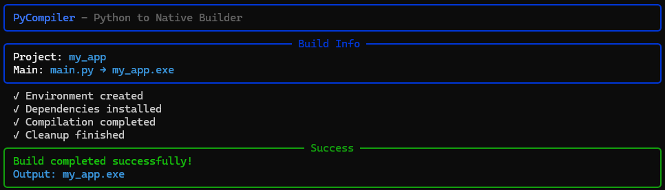

# PyNexe

> **Python to Windows executable builder**

## What it does

Builds standalone Windows .exe files from Python scripts using native compilation.

**Key Innovation:** Simplifies Nuitka building with a clean YAML configuration and rich CLI interface.

## Why PyNexe?

While Nuitka provides excellent native compilation, it can be complex to configure. PyNexe wraps Nuitka with:

- **Simple YAML configuration** instead of complex command lines
- **Rich CLI interface** with progress tracking
- **Isolated build environments** for consistent results
- **Windows metadata support** for professional executables
- **Automatic optimizations** like UPX compression

## Installation

```bash
pip install -r requirements.txt
```

**Requirements:** Python 3.7+, Windows

## Quick Start

1. **Create config.yaml:**
```yaml
project_name: "my_app"
main_file: "main.py"
output_name: "my_app.exe"
project_libs:
  - "requests"
```

2. **Build:**
```bash
python builder.py
```

3. **Done:** `my_app.exe` ready to distribute

## Example

**main.py:**
```python
import requests

def main():
    response = requests.get("https://api.github.com")
    print(f"Status: {response.status_code}")

if __name__ == "__main__":
    main()
```

**config.yaml:**
```yaml
project_name: "github_checker"
main_file: "main.py"
output_name: "github_checker.exe"
project_libs:
  - "requests"
```

**Result:** `github_checker.exe` (standalone)

## Features

### 🚀 **Native Building**
- Builds Python to native C++ code via Nuitka
- Optimized execution performance
- Smaller executable sizes
- Fast startup times

### 🔒 **Security**
- Compiled binary protection
- Source code obfuscation
- Professional executable properties

### ⚙️ **Developer Experience**
- YAML-based declarative setup (vs complex Nuitka commands)
- Rich CLI with progress tracking
- Isolated build environments
- Windows metadata support
- UPX compression optimization

## Use Cases

- Desktop GUI applications
- CLI tools and utilities
- Data analysis scripts
- Web scrapers and automation
- API clients and services
- System administration tools
- Commercial software distribution

## Configuration

**Required:**
```yaml
project_name: "my_app"      # App name
main_file: "main.py"        # Main file
output_name: "my_app.exe"   # Output exe
```

**Optional:**
```yaml
project_libs:               # Dependencies
  - "requests"
  - "pandas"

include_packages:           # Extra packages
  - "src"

icon_file: "icon.ico"       # Windows icon

windows_metadata:           # Exe properties
  product_name: "My App"
  file_description: "My Python Application"
  product_version: "1.0.0.0"
  copyright: "My Company"
```

## Usage

```bash
python builder.py                    # Build
python builder.py --info            # Check config
python builder.py --config my.yaml  # Custom config
```



## How it works

1. Creates isolated build environment
2. Installs your dependencies
3. Builds with Nuitka (Python → native)
4. Applies optimizations (UPX compression)
5. Cleans up temporary files
6. Delivers executable

## Antivirus Warnings

⚠️ **Important:** Generated .exe files may trigger antivirus alerts. This is normal and expected.

**Why this happens:**
- Compiled Python executables are often flagged as suspicious
- UPX compression can trigger heuristic detection
- New/uncommon executables are treated as potential threats

**Solutions:**
- **Add to whitelist** - Add the .exe to your antivirus exceptions
- **Submit for analysis** - Report false positive to your antivirus vendor
- **Use digital signature** - Sign your executable with a certificate
- **Test thoroughly** - Ensure your code is clean and safe

## Troubleshooting

- **Missing dependencies** → Add to `project_libs`
- **Large file size** → UPX compression enabled
- **Build errors** → Check Python syntax and dependencies
- **Antivirus alerts** → Add to whitelist or submit for analysis

## Project Structure

```
pynexe/
├── builder.py            # Build tool
├── src/
│   ├── cli.py           # Command interface
│   └── engine.py        # Build engine
├── config.yaml          # Configuration
└── requirements.txt     # Dependencies
```

---
